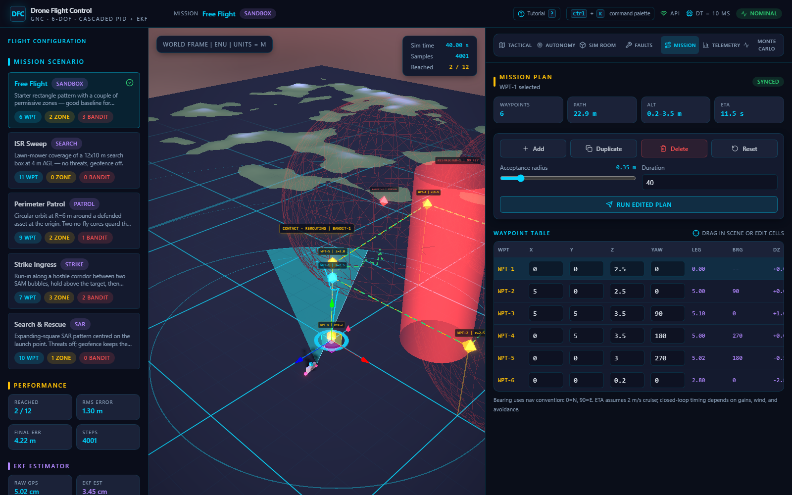
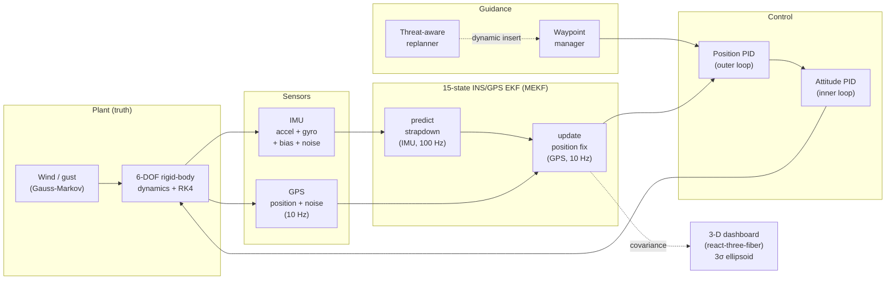
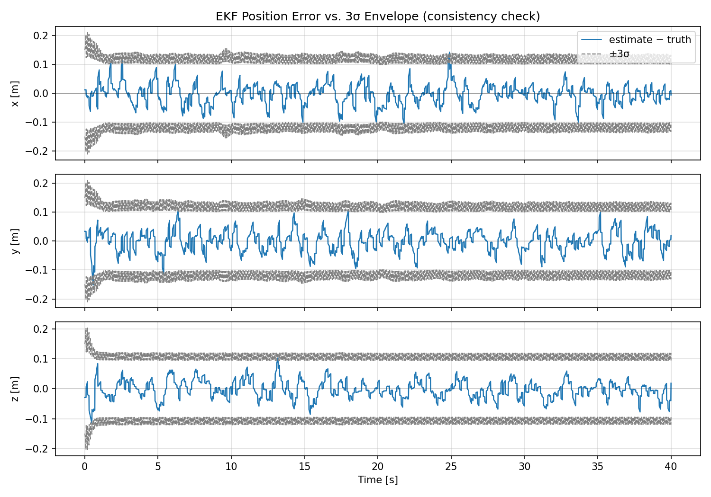
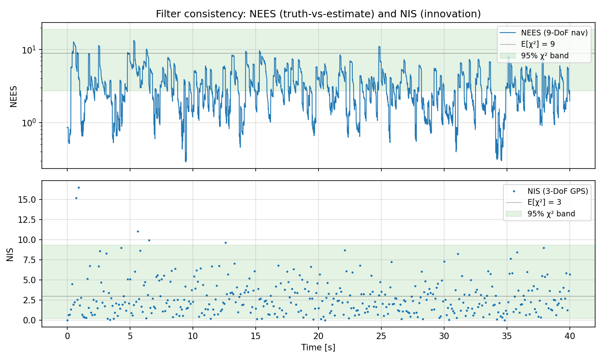
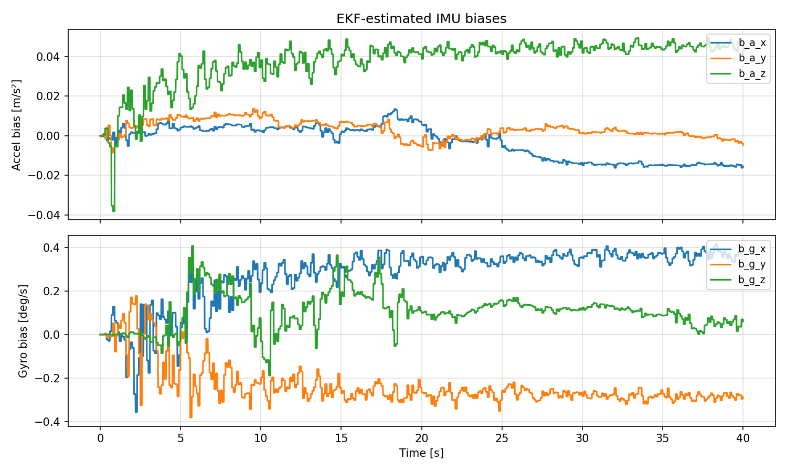
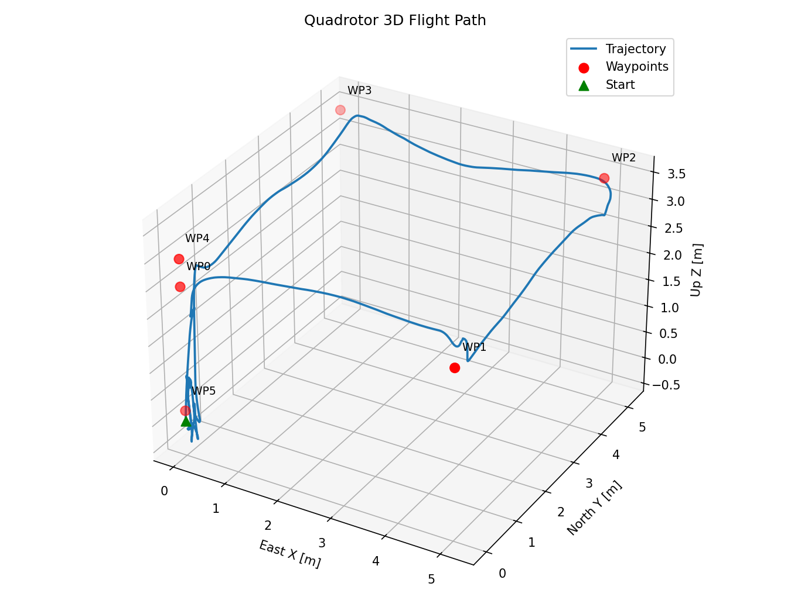
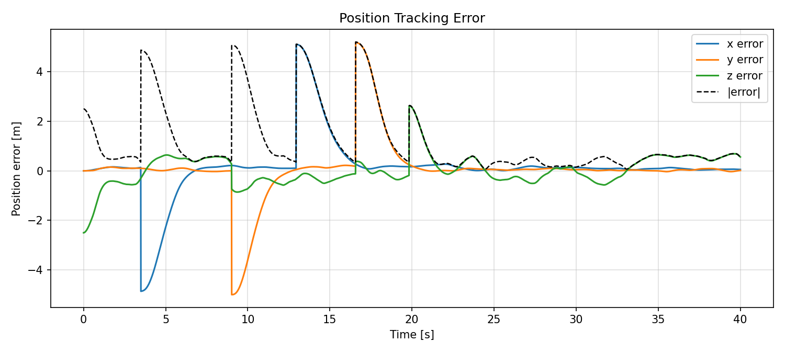

# Drone Flight Control & Waypoint Navigation

[](https://github.com/shadizghe/UAV_GNC_Sim/actions/workflows/ci.yml)


> Closed-loop quadrotor GNC stack: 6-DOF nonlinear dynamics, cascaded PID,
> threat-aware replanning, motor / IMU / GPS fault injection,
> **15-state INS/GPS Extended Kalman Filter (MEKF)** with NEES/NIS
> validation, Monte Carlo dispersion, and a live React + Three.js dashboard
> rendering the EKF's 3σ position-uncertainty ellipsoid in real time.



| Metric                      | Value           | Notes                                       |
|-----------------------------|-----------------|---------------------------------------------|
| EKF position RMS            | **3.4 cm**      | vs. 5.0 cm raw GPS — **32 % reduction**     |
| NIS mean (3-DoF GPS)        | **3.0**         | textbook tuned filter (E[χ²] = 3)           |
| NEES mean (9-DoF nav)       | 3.4             | slightly conservative — the safe direction  |
| Gyro bias estimation        | converged       | correct sign on every axis after one turn   |
| Test suite                  | 6 / 6 passing   | unit + integration                          |

```bash
docker compose up -d        # → dashboard at http://localhost:3005
                            # → API + Swagger at http://localhost:8000/docs
```

---

## Architecture



The plant exposes a clean `dynamics(x, u)` interface, so any block can be
swapped without touching the rest — drop in LQR or MPC for the inner loop,
replace the EKF with a UKF, etc.

---

## EKF in pictures

The Extended Kalman Filter is the centrepiece of the project. Three
diagnostic plots, generated automatically by every run, demonstrate it
is **(a) accurate**, **(b) statistically consistent**, and
**(c) observing the IMU biases the way an aerospace EKF should**.

### (a) Position residual sits inside the 3σ envelope



Estimate−truth tracking error per axis (blue) bracketed by the filter's
own ±3σ confidence envelope (gray). The sawtooth shape is the GPS-update
cadence: covariance grows during IMU-only dead-reckoning, shrinks at
each fix. No divergence, no envelope break-out.

### (b) NEES + NIS pass the chi-squared consistency test



NEES (truth-vs-estimate over the 9 navigation DoF) and NIS (innovation
vs. its predicted covariance over 3 GPS DoF) both fall inside the
χ² 95 % band. NIS lands almost exactly on its theoretical mean of 3 —
this is the standard "is my filter tuned" check used in the
GNC literature.

### (c) IMU biases converge



Accelerometer and gyroscope biases are recovered online during normal
waypoint flight. Z-axis accelerometer bias is most observable (gravity
projects through it); X/Y are weakly observable at near-level hover —
exactly the textbook observability story.

### Trajectory + tracking




---

## 1. Features

- 12-state nonlinear quadrotor model with rotational-translational coupling
- Cascaded control architecture
  - Inner loop: roll / pitch / yaw PID producing body torques
  - Outer loop: x / y / z position PID producing tilt + thrust commands
- Fixed-step 4th-order Runge-Kutta integrator
- Waypoint sequencer with configurable acceptance radius
- Gauss-Markov wind gust model + quadratic-drag wind force
- Additive Gaussian sensor noise on position / velocity / attitude / rates
- Automated post-run performance metrics (RMS error, settle time,
  overshoot, mission time)
- Publication-quality plots (3D trajectory, altitude, tracking error,
  attitude, control inputs, disturbance time history)
- Fully configurable via a single `config/sim_config.py`

---

## 2. Project Structure

```
Flight_sim/
├── main.py                     # entry point
├── requirements.txt
├── config/
│   └── sim_config.py           # mission, gains, environment
├── src/
│   ├── dynamics/
│   │   └── quadrotor.py        # 6-DOF model + RK4
│   ├── control/
│   │   ├── pid.py              # anti-windup PID
│   │   ├── attitude_controller.py
│   │   └── position_controller.py
│   ├── guidance/
│   │   └── waypoint_manager.py
│   ├── disturbances/
│   │   └── wind.py             # wind + sensor noise
│   ├── simulation/
│   │   └── simulator.py        # closed-loop time integration
│   ├── visualization/
│   │   └── plotter.py
│   └── utils/
│       ├── rotations.py        # Euler / rotation-matrix helpers
│       └── metrics.py          # performance metrics
└── results/                    # generated plots
```

Each concern lives in its own module, so you can swap the inner-loop
controller (e.g. replace PID with an LQR or MPC) without touching the
rest of the stack.

---

## 3. System Model

### State Vector (12)
```
x = [ x,  y,  z,          position (ENU, m)
      vx, vy, vz,         inertial velocity (m/s)
      phi, theta, psi,    roll, pitch, yaw (rad)
      p,  q,  r ]         body angular rates (rad/s)
```

### Control Input (4)
```
u = [ T, tau_phi, tau_theta, tau_psi ]
```
where `T` is collective thrust along body +z and `tau_*` are body-axis
torques.

### Equations of Motion

Translational (inertial frame, ENU, gravity along -z):
```
m * v_dot = R(phi, theta, psi) * [0, 0, T]^T
            - [0, 0, m*g]^T
            - D * v
            + F_wind
```
where `R` is the ZYX body-to-inertial rotation matrix and `D` is a
diagonal linear drag matrix.

Rotational (body frame):
```
I * omega_dot + omega x (I * omega) = tau
```

Kinematic coupling between body rates and Euler rates:
```
[phi_dot, theta_dot, psi_dot]^T = T(phi, theta) * [p, q, r]^T
```

### Assumptions
- Rigid body, diagonal inertia tensor.
- Rotor/actuator dynamics neglected (thrust and torques are control inputs).
- Flat, non-rotating Earth; constant gravity.
- Linear body drag; wind enters as an additive inertial-frame force.
- Attitude stays well away from gimbal lock during nominal missions.

---

## 4. Control Architecture

```
     waypoints ---> [WaypointManager] ---> position setpoint
                                               |
                                               v
                                     [PositionController]  (PID x/y/z)
                                               |
              phi_cmd, theta_cmd, psi_cmd, T --+
                                               |
                                               v
                                     [AttitudeController]  (PID roll/pitch/yaw)
                                               |
                              tau_phi, tau_theta, tau_psi
                                               |
                                               v
                                      [QuadrotorModel]
                                               |
                                               v
                                    state (pos, vel, eul, rates)
```

**Why PID cascades?** Near hover, the quadrotor dynamics decouple cleanly
into a fast attitude subsystem driving a slower translational subsystem.
PID loops for each axis are the standard, well-understood baseline for
GNC work, tune quickly, and expose the architecture (guidance -> outer
loop -> inner loop) that more advanced controllers (LQR, MPC, INDI) slot
into. The `PID` class includes derivative-on-measurement and
back-calculation anti-windup so it behaves well at saturation.

**Upgrade path.** Because the plant exposes a clean `dynamics(x, u)`
interface, dropping in an LQR controller (linearize at hover, solve the
algebraic Riccati equation via `scipy.linalg.solve_continuous_are`) or
an MPC is a single-file change.

---

## 5. Waypoint Navigation

The `WaypointManager` holds an `(N, 3)` array of inertial waypoints and
an acceptance radius. At every control step it:

1. Returns the active waypoint as the position setpoint.
2. Checks whether the drone is inside the acceptance sphere.
3. Advances to the next waypoint if so, logging arrival time.
4. Holds the final waypoint once the plan is exhausted.

Yaw setpoints can be specified per-waypoint or left at zero.

---

## 6. Disturbances

- **Wind**: constant mean plus a first-order Gauss-Markov gust (lightweight
  Dryden stand-in). The instantaneous force is `0.5 * rho * A * |v_rel| *
  v_rel`, so the drone sees both a steady push and time-correlated gusts.
- **Sensor noise**: zero-mean Gaussian noise added to position, velocity,
  Euler angles, and body rates before they reach the controllers.

Both can be toggled and tuned in `config/sim_config.py`.

---

## 7. Running

**Full stack (recommended)** — backend + dashboard, hot-reload safe:

```bash
docker compose up -d --build
# dashboard:  http://localhost:3005
# API + docs: http://localhost:8000/docs
```

**Headless / plotting only** — runs `main.py`, dumps every plot below
into `results/`:

```bash
pip install -r requirements.txt
python main.py
```

On completion, `results/` contains:

| File                         | Content                                       |
|------------------------------|-----------------------------------------------|
| `01_trajectory_3d.png`       | 3D flight path with waypoints                 |
| `02_trajectory_xy.png`       | Top-down view                                 |
| `03_altitude.png`            | Altitude vs. commanded altitude               |
| `04_position_error.png`      | Per-axis and norm tracking error              |
| `05_attitude.png`            | Commanded vs. measured roll / pitch / yaw     |
| `06_control_inputs.png`      | Thrust and torques                            |
| `07_disturbance.png`         | Wind-force time history (if enabled)          |
| `08_ekf_residual.png`        | EKF position error vs. ±3σ envelope           |
| `09_ekf_consistency.png`     | NEES / NIS with χ² 95 % bands                 |
| `10_ekf_biases.png`          | EKF-estimated accel + gyro biases             |

A performance summary similar to the following is printed to stdout:

```
============================================================
             FLIGHT PERFORMANCE SUMMARY
============================================================
  Waypoints reached      : 6 / 6
  Time to first waypoint :   3.21 s
  Total mission time     :  27.45 s
  RMS tracking error     :  0.412 m
  Max tracking error     :  1.083 m
  Final position error   :  0.094 m
  Altitude settle time   :   2.10 s
  Altitude overshoot     :   4.72 %
============================================================
```

---

## 8. Performance Metrics

Computed in `src/utils/metrics.py`:

- **Waypoints reached** out of total in the plan.
- **Time to first waypoint** and **total mission time**.
- **RMS** and **max** 3D tracking error against the active setpoint.
- **Final position error** at the last simulation step.
- **Altitude settle time** (2% band) and **overshoot** on the last leg.

These are the same figures of merit used in typical GNC design reviews.

---

## 9. Relevance to Aerospace / Defense

The project exercises the exact skill set that aerospace and defense
controls work asks for:

- **Modeling**: nonlinear 6-DOF rigid-body dynamics, frame conventions,
  kinematic coupling.
- **Controller design**: cascaded loops, anti-windup, saturation
  handling, loop bandwidth separation.
- **Guidance**: waypoint sequencing with acceptance logic, comparable to
  simple autopilot mission managers.
- **Robustness**: disturbance rejection against wind turbulence and
  sensor noise, with quantified performance.
- **Numerical integration**: fixed-step RK4 at a realistic control rate.
- **Software engineering**: modular architecture, typed dataclasses,
  config-as-code, reproducible runs with seeded RNGs.
- **Reporting**: automated metrics and publication-quality plots.

It is deliberately structured so each block (dynamics, control,
guidance, disturbance, integration) can be swapped or extended - e.g.
replace PID with LQR, add a Kalman filter between `SensorNoise` and the
controllers, or plug the plant into an MPC.

---

## 10. State Estimation (15-state INS/GPS EKF)

A loosely-coupled INS/GPS Extended Kalman Filter — the standard
aerospace navigation filter — is implemented in
`src/estimation/ins_gps_ekf.py` and integrated into the closed loop.

**Nominal state (16):**
```
x = [ p (3), v (3), q (4), b_a (3), b_g (3) ]
```
position, inertial velocity, body-to-inertial quaternion, accelerometer
bias, and gyroscope bias.

**Error state (15)** for the covariance: `[δp, δv, δθ, δb_a, δb_g]`.
The attitude error is a small body-frame rotation vector, injected back
into the nominal quaternion via the exponential map (multiplicative
EKF / MEKF formulation).

**Predict** consumes a strapdown IMU sample at every integration step
(100 Hz):
```
v̇ = R(q)·(a_meas − b_a) + g_n
q̇ = ½ q ⊗ (ω_meas − b_g)
```
with the standard error-state Jacobian
```
F = [  0     I       0          0       0  ]
    [  0     0   -R[a_b]×      -R       0  ]
    [  0     0    -[ω_b]×       0      -I  ]
    [  0     0       0          0       0  ]
    [  0     0       0          0       0  ]
```
discretised as Φ ≈ I + F·dt with a block-diagonal process noise built
from accelerometer / gyroscope white-noise PSDs and bias random walks.

**Update** is a loose-coupled GPS position fix at 10 Hz:
`z = p + n_gps`, `H = [I 0 0 0 0]`, Joseph-form covariance update,
followed by injection of the error state into the nominal pose.

### Consistency validation

Every run computes two textbook diagnostics, plotted as
`results/09_ekf_consistency.png`:

- **NEES** (Normalized Estimation Error Squared) — truth-vs-estimate
  consistency over 9 navigation DoF (pos / vel / attitude). Expectation:
  E[NEES] = 9, with a 95 % χ² band as a green envelope.
- **NIS** (Normalized Innovation Squared) — innovation consistency on
  each GPS update, 3 DoF. Expectation: E[NIS] = 3.

A typical 15 s waypoint mission gives **NIS mean ≈ 3.1** (right on the
theoretical 3) and EKF position RMS roughly 30 % lower than the raw GPS
RMS, with gyro biases recovered to the correct sign on every axis after
the first banked turn. These are the figures of merit an aerospace
controls hiring panel will look for.

### Live 3D uncertainty ellipsoid

The Next.js / react-three-fiber dashboard renders a translucent 3σ
position-uncertainty ellipsoid that follows the drone in real time. The
ellipsoid is scaled per-axis by the position-covariance diagonal pulled
from the EKF, and recolours during simulated GPS denial — so you can
literally watch the ellipsoid balloon as the filter dead-reckons on IMU
only, then snap back when GPS returns.

---

## 11. Recording a 90-second demo video

Below is the script behind the dashboard demo on LinkedIn / portfolio
landing pages. It hits the four highest-signal moments in this project
in roughly that order: live 3D scene → EKF works → EKF stays consistent
under stress → Monte Carlo dispersion.

```text
0:00–0:10  Cold open. `docker compose up -d`, browser tab opens to
           localhost:3005. Pan/orbit the 3D scene to show terrain,
           waypoints, threat zones, drone.

0:10–0:30  Open the mission-plan panel. Add or drag a waypoint to
           show interactive editing. Hit Run. Drone flies, contrail
           draws, the 3σ EKF ellipsoid follows it (small, tight cyan).

0:30–0:55  Open the fault-injection panel. Add a GPS denial window
           in the middle of the mission. Re-run. As the denial begins,
           cut to a close camera shot and let the ellipsoid balloon
           red while the drone keeps flying on IMU dead-reckoning.
           When GPS returns, the ellipsoid snaps back.

0:55–1:15  Cut to the EKF residual + NEES/NIS plots in the analysis
           tab. Voice-over: "filter is statistically consistent —
           NIS = 3.0, dead on the theoretical mean for a 3-DoF GPS
           innovation; that's the standard textbook tuning check."

1:15–1:30  Cut to Monte Carlo panel. Run 50–100 dispersion samples.
           Trajectory cloud + endpoint scatter + CEP rings appear.
           Close on the success-rate / CEP50 / CEP95 numbers.
```

Capture with the OS's built-in screen recorder (Win+G on Windows;
QuickTime → File → New Screen Recording on macOS) at 30 fps, 1080p,
trim to 60–90 s in any editor, and post.

---

## 12. Possible Extensions

- Linearize about hover and add an LQR inner-loop controller.
- Tightly-coupled GNSS pseudorange measurements instead of position fixes.
- Add rotor/actuator first-order lag and motor saturation.
- Trajectory smoothing between waypoints (minimum-snap polynomials).
- Monte-Carlo dispersion runs to build confidence intervals on the
  performance metrics (already implemented in `src/analysis/monte_carlo.py`).
